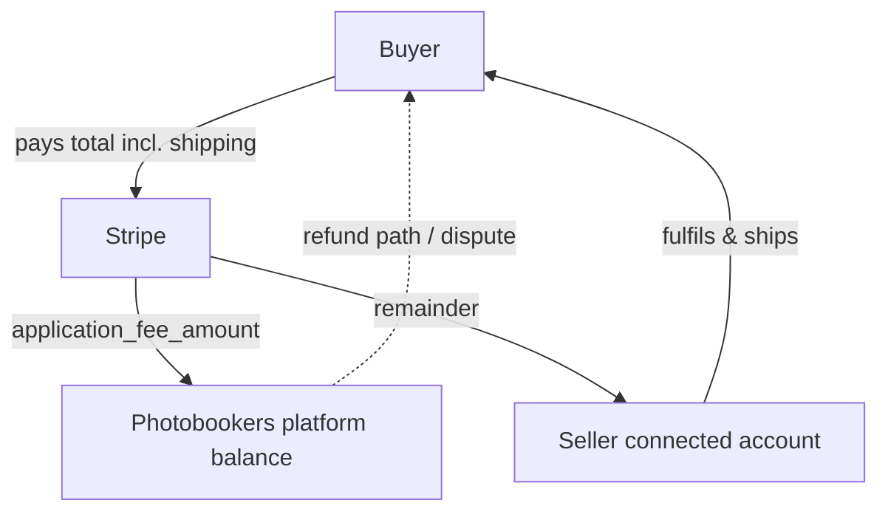
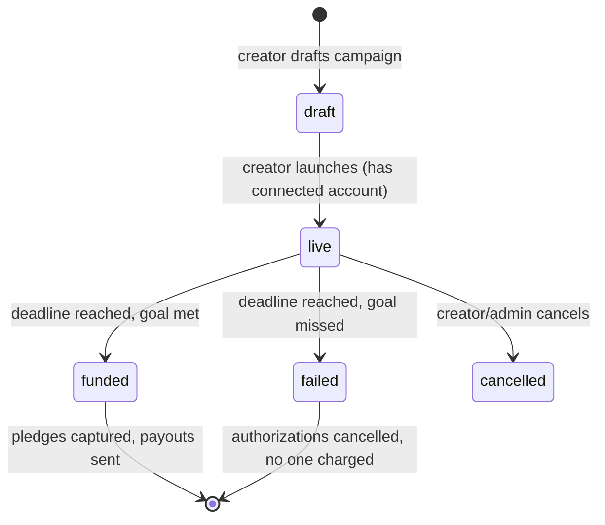

# Checkout & Crowdfunding Payments Layer

> Companion to [`monetisation-roadmap.md`](./monetisation-roadmap.md) (Phases 2–3). Build the payments core once; crowdfunding and marketplace both consume it.

## Assumptions (flip if you disagree)

1. **Stripe Connect, Express accounts, `destination`/`separate charges + transfers` with an `application_fee_amount`.** Photobookers is the marketplace facilitator; the seller is the connected account. Do not hand-roll split payments.
2. **No stock held.** Every order/pledge routes to exactly one seller who fulfils. Multi-seller carts are **out of scope v1** (one order = one seller). A buyer wanting books from two sellers places two orders.
3. **Crowdfunding first.** A campaign is a pre-order with a goal + deadline; pledges are authorized on pledge and **captured only if the campaign succeeds**. This exercises the same Stripe primitives as marketplace and front-loads cash.
4. **Commission is an application fee** taken at capture — the "we make money when you make money" rule is enforced by construction (no capture, no fee).
5. **Seller = existing `creators`** (artist or publisher) with a verified owner user. Only verified creators who own the book can sell/campaign it.

If you want multi-seller carts, or capture-on-pledge crowdfunding (charge immediately), say so before build.

## Money flow

Crowdfunding variant: pledge **authorizes** a PaymentIntent (manual capture). On deadline: goal met → capture all → fees + payouts; goal missed → cancel all authorizations, nobody charged.

## Data model

Add to [`src/db/schema.ts`](../src/db/schema.ts) (uuid PKs + timestamps like existing tables):

**`seller_accounts`** — one per selling creator
- `id`, `creatorId` (unique FK → `creators.id`), `stripeAccountId`, `chargesEnabled` bool, `payoutsEnabled` bool, `detailsSubmitted` bool, `country`, `defaultCurrency`, timestamps
- A book is sellable only if its owning creator has `chargesEnabled && payoutsEnabled`.

**`orders`** (marketplace) — one seller per order
- `id`, `buyerUserId` (FK → users, nullable for guest), `sellerCreatorId`, `status` enum: `pending | paid | fulfilled | shipped | cancelled | refunded`
- `stripePaymentIntentId`, `subtotalCents`, `shippingCents`, `taxCents`, `totalCents`, `applicationFeeCents`, `currency`
- `shippingName`, `shippingAddress` (structured), `buyerEmail`
- `trackingNote` (free text; carrier integration out of scope), `paidAt`, `shippedAt`, timestamps

**`order_items`**
- `id`, `orderId`, `bookId`, `quantity`, `unitPriceCents`, `titleSnapshot` (denormalized for receipts)

**`campaigns`** (crowdfunding)
- `id`, `creatorCreatorId` (seller), `bookId` (nullable — campaign may precede a full book record), `slug`, `title`, `description`
- `goalCents`, `pledgedCents` (running), `currency`, `deadline` timestamp
- `status` enum: `draft | live | funded | failed | cancelled`
- `rewardTiers` jsonb (label, priceCents, description, limit) — v1 can be a single "get the book" tier
- `applicationFeeBps` (basis points, snapshot of the fee at launch), timestamps

**`campaign_pledges`**
- `id`, `campaignId`, `backerUserId` (nullable), `backerEmail`, `tierLabel`, `amountCents`
- `stripePaymentIntentId` (manual-capture), `status` enum: `authorized | captured | cancelled | refunded`
- `shippingName`, `shippingAddress`, timestamps

**`ledger_entries`** (audit of money movement — optional but recommended)
- `id`, `type` (`order_capture | pledge_capture | refund | payout | fee`), `orderId?`, `campaignId?`, `pledgeId?`, `amountCents`, `feeCents`, `stripeRef`, `createdAt`

Add sellable flags to [`books`](../src/db/schema.ts): `forSale boolean default false`, `priceCents integer`, `currency` (defaults from seller account). Reuse `availabilityStatus` for out-of-stock.

Migration via existing flow: edit schema → `npm run db:generate` → `npm run db:migrate`.

## Domain layer

New module `src/domain/payments/` (shared across marketplace, crowdfunding, dashboards, admin, webhooks, emails):

- `stripe.ts` — Stripe client singleton (secret from env; **names only**, per repo rules).
- `connect.ts` — create/refresh Express account, onboarding link, account-status sync.
- `intents.ts` — create PaymentIntent with `application_fee_amount` + `transfer_data.destination`; capture; cancel; refund.
- `fees.ts` — single source of truth for commission % / platform-fee bps → fee cents. One place so the "we earn only on capture" rule is auditable.
- `webhooks.ts` — reconcile `payment_intent.succeeded/canceled`, `account.updated`, `charge.refunded`, `charge.dispute.created`; idempotent by Stripe event id.
- `orders.ts` / `campaigns.ts` — state-transition functions with guards (illegal jumps rejected), queries for buyer/seller/admin.

Keep this in `domain/` (imported by `(app)/`, dashboard, and cron) per the domain-vs-features boundary in CLAUDE.md. UI stays in `features/`.

## Seller onboarding (Stripe Connect Express)

- New dashboard section `/dashboard/selling` (or under existing creator dashboard): "Connect payouts" → Stripe Express onboarding link → return/refresh URLs.
- Sync `seller_accounts` from `account.updated` webhook; show status (pending / restricted / enabled).
- Gate "list for sale" and "start a campaign" on `chargesEnabled && payoutsEnabled`.

## Crowdfunding flow (build first)

- **Pledge:** create manual-capture PaymentIntent (authorize funds now), record `campaign_pledges` + bump `pledgedCents`.
- **Resolution cron** (add under `jobs/`, follows existing cron pattern): at `deadline`, if `pledgedCents >= goalCents` → capture all authorized intents (fee applied per capture) → mark `funded`; else cancel all authorizations → mark `failed`.
- **Auth expiry caveat:** Stripe authorizations expire (~7 days). For long campaigns, either re-authorize near capture, or use capture-on-pledge + refund-on-failure (simpler, but backers charged upfront). **Decide this before build** — it materially changes the flow.
- Emails at: pledge received, campaign funded/failed, capture receipt.

## Marketplace flow (build second, reuses core)

- **Buy on book page** (gated on `forSale` + seller enabled): add to cart / buy now. v1: single-seller order.
- **Checkout:** collect shipping address → compute shipping (seller settings) + tax → create PaymentIntent with application fee → confirm.
- **Fulfilment:** order lands in seller's `/dashboard/selling/orders` → accept → mark shipped (+ tracking note) → buyer emailed.
- Record `purchase_clicks`-style analytics still apply, but now the *conversion* is first-party — surface realized sales in the Phase 0 reach panel.

## Shipping & tax (the unglamorous blockers)

- **Shipping:** per-seller settings — flat rate, per-item, or by destination zone. Photobooks are heavy + cross-border; a flat "domestic / international" pair is an acceptable v1.
- **Tax/VAT:** decide marketplace-facilitator posture early. Options: (a) sellers responsible, Photobookers just facilitates; (b) Photobookers collects VAT via Stripe Tax. This is a **legal/ops decision** with code consequences — resolve before going live, not after.

## Trust, refunds & disputes (real risk of "no stock")

Buyers see *Photobookers* as the merchant of record even though a stranger ships.

- **Buyer-protection policy:** define refund window, "item not received" handling, and who eats the cost.
- **Refunds:** platform-initiated refund path (`intents.ts` refund) that also reverses the application fee where appropriate.
- **Disputes/chargebacks:** webhook to flag, admin surface to respond; decide whether platform or seller bears liability (Connect settings).
- **Campaign failure / under-delivery:** policy for a funded campaign that never ships — this is reputational, define it upfront.
- **Admin surfaces:** `/dashboard/admin/orders` and `/dashboard/admin/campaigns` for oversight, refunds, and dispute handling (reuse `admin_notifications` for new-dispute / failed-payout alerts).

## Feature flags & rollout

Add to [`featureFlags.json`](../featureFlags.json): `crowdfunding: false`, `marketplaceCheckout: false`. Ship dark, enable per-surface.

## Environment / secrets

New env vars (names only, per repo safety rules): `STRIPE_SECRET_KEY`, `STRIPE_WEBHOOK_SECRET`, `STRIPE_CONNECT_CLIENT_ID`, and public publishable key for client confirm. Never commit values; `.env.production` holds real credentials.

## Suggested build order (PRs)

1. **Schema + `domain/payments` core (stripe, connect, intents, fees, webhooks)** — no UI, unit-tested against Stripe test mode.
2. **Seller Connect onboarding** + status gating.
3. **Crowdfunding: campaign CRUD + pledge (authorize) + resolution cron + payouts + emails.**
4. **Marketplace: sellable book fields + single-seller checkout + seller fulfilment dashboard + emails.**
5. **Shipping settings + tax decision wired into checkout.**
6. **Refund/dispute/admin oversight + buyer-protection policy surfaced.**

## Out of scope (unless you want them)

- Multi-seller carts / split shipments in one order
- Carrier/tracking-number integration (free-text tracking only v1)
- Subscriptions or saved payment methods
- Physical inventory / stock counts (never held)
- Hyperview/mobile checkout (web first; add mobile routes later)
- International duties/customs calculation beyond basic VAT posture
