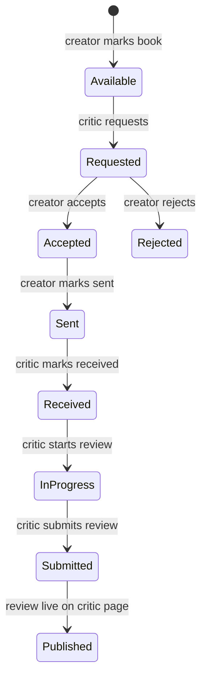

# Critics & Book Reviews

## Assumptions (flip if you disagree)

1. **Critic onboarding:** application + admin approval (mirrors creator claims). Fans can apply; only approved critics can request books.
2. **Hand-off signals:** email at each state change + dashboard queues (no new in-app notification feed yet).
3. **Critic public page:** new `/critics/[slug]` listing their published reviews.

If you want self-serve critics, or dashboard-only (no email), say so before build.

## Workflow

Parallel display controls (orthogonal to workflow):

- **Admin:** `promoted` (homepage + `/reviews`)
- **Creator:** `featuredOnBook` (which submitted review shows on `/books/[slug]`)

## Data model

Add to [`src/db/schema.ts`](../src/db/schema.ts):

**`critics`** (mirror of `creators`, lighter)

- `id`, `userId` (unique FK → users), `slug`, `displayName`, `bio`, `status` (`pending` | `verified` | `suspended`), `verifiedAt`, timestamps
- Shipping address fields on critic profile (or on each request — prefer **on request** so address can change per shipment)

**`book_review_availability`** (or boolean on books)

- Prefer column on `books`: `availableForReview boolean default false` — simplest; only verified creators who own the book can toggle it

**`book_review_requests`**

- `id`, `bookId`, `criticId`, `creatorId` (who must act — artist or publisher owner)
- `status` enum: `requested | accepted | rejected | sent | received | in_progress | submitted`
- `message` (critic note), `shippingName`, `shippingAddress` (text or structured fields)
- `statusChangedAt`, timestamps
- Unique: one active request per (bookId, criticId) where status not `rejected`

**`book_reviews`**

- `id`, `requestId` (unique), `bookId`, `criticId`
- `title`, `body` (markdown/plain), `rating` optional
- `publishedAt`
- `promoted` boolean (admin) + `promotedAt` / `promotedSortOrder`
- `featuredOnBook` boolean (creator picks; at most one true per book — enforce in service)

Migration via existing flow: edit schema → `npm run db:generate` → `npm run db:migrate`.

## Auth / roles

- Extend `AuthUser` in [`types.ts`](../types.ts) with `critic: Critic | null`
- Load critic in [`src/middleware/getUserFromToken.ts`](../src/middleware/getUserFromToken.ts) alongside creator
- New helpers in [`src/lib/permissions.ts`](../src/lib/permissions.ts): `isVerifiedCritic`, `canRequestReview`, `canManageReviewRequest` (creator vs critic side)
- Guards: `requireCritic` for critic dashboard routes; reuse `requireCreatorEditAccess` / book ownership for creator side
- Dashboard access today requires `user.creator` for most pages — critic dashboard needs its **own shell** so fans-turned-critics can use `/dashboard/critic/*` without being creators

## Surfaces

### Critic

- Apply: `/critics/apply` (or upgrade CTA from fan profile) → admin reviews at `/dashboard/admin/critics`
- Dashboard: `/dashboard/critic` — available books list, my requests (by status), write/submit review
- Public: `/critics/[slug]` — bio + published reviews

### Creator

- On book edit ([`dashboard/books/[bookId].tsx`](../src/fs-routes/dashboard/books/[bookId].tsx)): toggle **Available for review**
- New tab or section under creator dashboard: incoming requests → accept/reject → mark sent; after submit, pick which review is featured on the book page

### Admin

- `/dashboard/admin/critics` — approve/reject applications (clone claims pattern)
- `/dashboard/admin/reviews` — list reviews, toggle `promoted`, optional sort order
- Admin notification on new critic application (reuse `admin_notifications`)

### Public

- `/reviews` — promoted (and optionally recent) reviews
- Homepage [`featured.tsx`](../src/fs-routes/(app)/featured.tsx) — new section or lazy fragment of promoted reviews
- Book page — section beside/near [`BookPressSection`](../src/features/app/components/bookPage/BookPressSection.tsx) showing the creator-featured review (link to full review + critic)
- Critic page as above

## Domain layer

New module `src/domain/reviews/` (shared across public, critic dashboard, creator dashboard, admin, emails):

- Status transition functions with guards (illegal jumps rejected)
- Queries: available books, requests for critic/creator, promoted reviews, featured review for book
- Keep UI in `src/features/dashboard/critic/`, `src/features/dashboard/reviews/` (creator), `src/features/dashboard/admin/critics|reviews/`, `src/features/app/reviews/`

Emails: thin wrappers around existing send helpers at each transition (request → creator; accept/reject/sent → critic; received/submitted → creator optional).

## Feature flag

Add `bookReviews: false` to [`featureFlags.json`](../featureFlags.json) so rollout is gated like `bookPressLinks`.

## Suggested build order (PRs)

1. **Schema + domain transitions + permissions** (no UI)
2. **Critic apply + admin approve + AuthUser.critic**
3. **Creator: available-for-review toggle + request inbox (accept/reject/sent)**
4. **Critic dashboard: browse available → request → receive → in progress → submit**
5. **Public: critic page, review page, book-page featured review**
6. **Admin promote + homepage + `/reviews` listing**

## Out of scope (unless you want them)

- In-app notification feed for non-admins
- Tracking numbers / carrier integration
- Multiple featured reviews per book
- Ratings aggregation / stars on book cards
- Hyperview/mobile routes for this flow
- Replacing `pressLinks` (keep external press separate from in-platform reviews)
