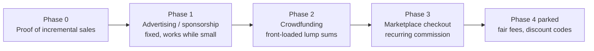

# Monetisation Roadmap

## North-star rules (test every idea against these)

1. **"We make money when you make money."** Success-based / aligned incentive. The onboarding wedge for wary sellers: *no upfront fee, no monthly fee — we only earn when we sell your book.*
2. **No fixed subscriptions / rent.** Creator/publisher SaaS tiers are off-brand and deliberately excluded.
3. **Editorial is never for sale.** Book of the Day, Artist of the Week, Publisher of the Week stay *earned* and un-buyable. Advertising lives only in newsletter / dedicated email / social campaign / website banner / magazine sponsorship, and is always clearly labelled.
4. **The whole model rests on one proof:** that discovery drives *incremental* sales a seller wouldn't otherwise get. Everything downstream depends on making that provable.

## The sequencing problem this plan solves

Success-based revenue is thinnest exactly when the site is smallest. So the phases are ordered by **when they can actually earn**, not by ambition:

- **Fixed revenue (ads) carries the survival phase** — it is the *only* stream that doesn't need transaction volume.
- **Crowdfunding front-loads cash** — big lump sums, fee taken upfront, and it shares payments infra with the marketplace.
- **Marketplace commission is the long-run recurring engine** — but only worth the build once Phase 0 proves traffic converts.

---

## Phase 0 — Proof of incremental sales (do first, cheap)

**Goal:** make "Photobookers sent you buyers" a first-class, seller-visible number. Without it, every success-based pitch is unfounded.

- You already capture the signal: [`purchase_clicks`](../src/db/schema.ts) (with UTM tagging in [`src/features/purchase-clicks/urls.ts`](../src/features/purchase-clicks/urls.ts)), plus `book_views`, `wishlists`, `follows`, `collections`.
- Add a seller-facing "reach" panel to the creator dashboard: outbound purchase clicks, views, wishlist adds, and follower growth per book and per period.
- This panel *is* the sales deck for Phases 1–3. Frame it as "demand we're generating for you," not just analytics.

**Exit criterion:** you can show a real seller a credible "we drove N buyers to you last month" number.

## Phase 1 — Advertising & sponsorship (the survival-phase earner)

**Goal:** the one stream that earns while the audience is still small, because it's a fixed media buy, not a cut of transactions.

Inventory (all clearly labelled as sponsored; none touch editorial slots):

- **Sponsored newsletter placement** — an ad unit inside the weekly newsletter.
- **Dedicated / exclusive newsletter** — a whole send for one advertiser.
- **Coordinated social campaign** — a planned run across the existing Instagram/Buffer planner.
- **Website banner** — a labelled banner unit (define placements + a simple served-order, not an ad network).
- **Magazine presenting sponsor** — per-issue "this issue presented by …" tied to the magazine generator work.

Build notes:

- Model this as **bookable inventory**, not editorial: a lightweight `sponsorships` concept (advertiser, placement type, run dates, creative asset, labelled status) rather than reusing BOTD/AOTW tables.
- Reuse the admin **planner** surfaces for scheduling social/newsletter sponsorship so it slots into existing ops.
- Keep a hard visual + data separation between "sponsored" and "editorial" so trust never erodes.

**Exit criterion:** at least one repeatable, labelled ad product that a sponsor has paid for.

## Phase 2 — Crowdfunding (front-loaded, success-based; likely flagship)

**Goal:** let creators crowdfund a photobook to an audience of actual collectors; take a platform fee on funds raised. Front-loads cash and validates demand.

- A campaign is a **pre-order with a funding goal and a deadline** — mechanically the same as a marketplace order, so it shares the Phase 3 payments layer (build the payments core here, reuse it there).
- Fee model: platform fee % on successfully funded campaigns (aligned with the north star — you only earn if the campaign funds).
- Leans directly on your differentiator: discovery + demand-validation + pre-sales in one loop, to a niche audience Kickstarter can't target.
- See the companion build plan: [`checkout-crowdfunding-payments.md`](./checkout-crowdfunding-payments.md).

**Exit criterion:** a creator has run a funded campaign and Photobookers has taken its fee via automated split payout.

## Phase 3 — Marketplace checkout (recurring commission engine)

**Goal:** buyers check out on Photobookers; the seller fulfils (Photobookers never holds stock); commission taken per sale.

- Purest form of the north star. Built on the same Stripe Connect split-payment core as Phase 2.
- The seller's real objection — *"why give up a cut vs. my own 0% shop?"* — is only answerable with the Phase 0 proof that you drove the buyer. **Do not build this before that proof exists.**
- Own the hard parts deliberately: fulfilment trust, shipping cost + VAT (heavy, cross-border books), returns/disputes, and the fact that buyers blame *Photobookers* though a stranger ships. These are policy/ops decisions, not just code.
- See the companion build plan for the full technical breakdown.

**Exit criterion:** a real order is bought on-site, routed to the seller, fulfilled, and the seller is paid out minus commission automatically.

## Phase 4 — Parked (revisit only when large)

- **Fair-organiser fees** — charge fairs/organisers for featured/verified listings. Only credible once the audience is a meaningful channel for a fair. Uses existing `bookFairs` / `fairAttendees` / `fairViews`.
- **Negotiated publisher discount codes** — real value but high-ops (per-publisher negotiation + code management). Park until there's headcount for partnerships.

## Cross-cutting concerns

- **Feature-flag every phase** in [`featureFlags.json`](../featureFlags.json) (e.g. `sponsorships`, `crowdfunding`, `marketplaceCheckout`) so surfaces can ship dark.
- **Trust & liability policy** is the real risk of "we don't hold stock" — define buyer protection, refund, and campaign-failure policy *before* taking money, not after.
- **Tax/VAT & payouts** need real answers before Phases 2–3 go live (cross-border, marketplace facilitator rules).
- **Editorial firewall** is a recurring review item: any new ad product must pass "does this let someone buy their way into curation?" — if yes, redesign it.

## Suggested order of work

1. Phase 0 seller "reach" panel (small, unblocks every pitch).
2. Phase 1 sponsored newsletter + banner (first real revenue while small).
3. Phase 2 crowdfunding on the shared payments core (`checkout-crowdfunding-payments.md`).
4. Phase 3 always-on marketplace checkout reusing that core.
5. Phase 4 only when audience justifies it.
